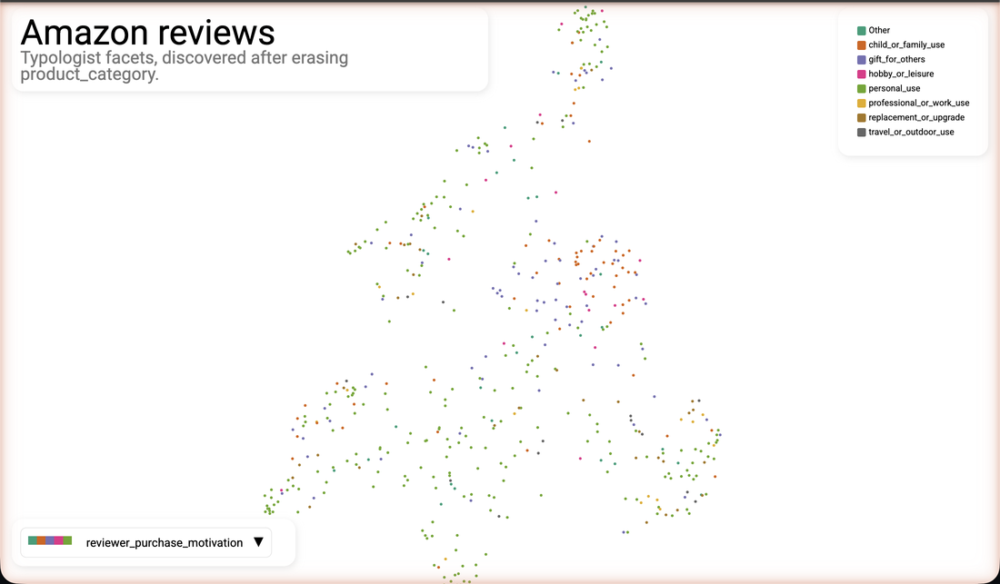

# Typologist

Extract a categorical schema from a corpus of documents.

## Status

**Pre-alpha.** The public API will change as we figure things out. See [`docs/design.md`](docs/design.md) for the current contract.

## What it does

You give it documents and their embeddings. It gives you back a handful of *facets* (each a named categorical dimension with a short list of values) and a per-document label on each facet. Run it on a stratified sample of 500 Amazon product reviews and you get three facets (`product_category`, `reviewer_sentiment`, and `review_focus_aspect`), each with a definition and 5-10 values, plus a 500-row DataFrame of per-doc labels you can join straight back onto the original corpus. Worked example with real output below.

What makes Typologist's facets mutually orthogonal rather than redundant is concept erasure. After each facet is discovered, its per-document labels are erased from the embeddings via [LEACE](https://github.com/EleutherAI/concept-erasure), and the next facet is discovered against the residual. If you pass in known metadata (existing category tags, ratings, source) it's erased the same way up front, so discovery starts from embeddings orthogonal to what you already have.

## Why not just topic modeling?

If you've used BERTopic or similar, the question worth asking up front is how this is different:

- **Multiple orthogonal axes, not one partition.** A topic model gives you one bucket per document. Typologist gives you `n_facets` simultaneous values per document (sentiment AND focus-aspect AND product-category), each defined and labeled separately, so cross-cutting analysis is a one-line `groupby` rather than a second clustering pass.
- **Concept-labeled values, not keyword bags.** Each facet's values are short phrases (`fit_and_sizing`, `value_for_money`) backed by an LLM-written labeling prompt that can be reapplied to new documents. There's no c-TF-IDF keyword list to interpret.
- **Erasable priors.** If your corpus comes pre-tagged with structure you already know (product category, year, source), pass it as `metadata=` and Typologist will discover axes orthogonal to it, instead of rediscovering it as Facet 0.

## Install

Requires Python 3.11+. Pick a provider extra; the package itself is provider-neutral.

```bash
uv add 'typologist[anthropic]'
# or: pip install 'typologist[anthropic]'
```

Extras: `[anthropic]`, `[openai]`, `[all]`. None of them are activated by default. If you want to wire up your own provider via a `Callable[[str], str]`, install bare `typologist` and skip the extras entirely.

You'll also want:

- An API key for whichever provider you picked: `ANTHROPIC_API_KEY` for `AnthropicLLM`, `OPENAI_API_KEY` for `OpenAILLM`. The example below uses Anthropic.
- A sentence-embedding model that Toponymy (the cluster-naming library Typologist builds on) can use internally for keyphrases and topic names. `sentence-transformers` with MiniLM is cheap and good enough for most use cases:

  ```bash
  uv pip install sentence-transformers
  ```

> [!IMPORTANT]
> Fitting Typologist makes paid LLM API calls. With the Anthropic Haiku/Opus mix shown below, expect about $3 per 500-doc fit at `n_facets=3`; other providers will differ. See [Performance](#performance) for the breakdown and [Model choice](#model-choice) for ways to lower it.

## Quick start

```python
import numpy as np
from sentence_transformers import SentenceTransformer
from typologist import AnthropicLLM, Typologist

documents = [...]              # list[str], one per document
embeddings = np.array(...)     # shape (n_docs, d), float

t = Typologist(
    n_facets=3,
    topic_embedder=SentenceTransformer("all-MiniLM-L6-v2"),
    naming_llm=AnthropicLLM("claude-haiku-4-5"),
    schema_llm=AnthropicLLM("claude-opus-4-7"),
    labeling_llm=AnthropicLLM("claude-haiku-4-5"),
).fit(documents, embeddings)
```

The three LLM kwargs are required and have no defaults. Swap any of them for `OpenAILLM("gpt-4o-mini")`, a custom `LLM` subclass, or a plain `Callable[[str], str]` to use a different provider; the rest of the API stays the same.

Run on a stratified sample of 500 Amazon product reviews ([`examples/amazon_reviews.py`](examples/amazon_reviews.py) is the runnable script), `t.schema_` looks like:

```
Facet 0: product_category (categorical)
  The broad product domain that the review is about, distinguishing
  reviews by the type of item being evaluated.
  - books
  - apparel_and_footwear
  - kitchen_and_cookware
  - toys
  - personal_care_and_beauty
  - consumer_electronics
  - Other

Facet 1: reviewer_sentiment (categorical)
  The overall sentiment polarity and intensity expressed by the reviewer
  toward the product.
  - strongly_positive
  - mildly_positive
  - mixed
  - mildly_negative
  - strongly_negative
  - Other

Facet 2: review_focus_aspect (categorical)
  The primary product attribute or dimension the reviewer focuses their
  evaluation on.
  - fit_and_sizing
  - durability_and_build_quality
  - ease_of_use_and_instructions
  - sensory_experience
  - functional_performance
  - value_for_money
  - aesthetic_appearance
  - content_and_informational_value
  - Other
```

Each facet entry is a JSON-serializable dict (`name`, `kind`, `values`, `definition`, plus a stored `labeling_prompt_template` and `labeling_model` for reuse — see [Reusing a discovered schema](#reusing-a-discovered-schema)). Per-document labels live on `t.labels_df_` as a `(498, 3)` DataFrame of pandas Categoricals, positionally aligned with the input documents and ready to join back onto the source corpus.

Notice that Facet 0 above (`product_category`) rediscovers the curator-assigned product category that already came tagged onto these reviews. Concept erasure is what gets you past that.

## Discovery with metadata erasure

Pass a `metadata` DataFrame to erase known axes before discovery starts, so the facets Typologist finds are orthogonal to what you already had. Same Amazon corpus as above:

```python
import pandas as pd
from sentence_transformers import SentenceTransformer
from typologist import AnthropicLLM, Typologist

# df has columns "text" (review body) and curator-assigned "product_category"
documents = df["text"]
embeddings = ...               # shape (len(df), d)

t = Typologist(
    n_facets=3,
    topic_embedder=SentenceTransformer("all-MiniLM-L6-v2"),
    object_description="product reviews",
    corpus_description="Amazon product reviews",
    naming_llm=AnthropicLLM("claude-haiku-4-5"),
    schema_llm=AnthropicLLM("claude-opus-4-7"),
    labeling_llm=AnthropicLLM("claude-haiku-4-5"),
    random_state=0,
).fit(
    documents,
    embeddings,
    metadata=df[["product_category"]],
)

df_labeled = df.join(t.labels_df_)   # join labels back onto the source corpus
```

With `product_category` erased up front, Facet 0 is no longer a rediscovery of it, and Facet 2 is an axis the vanilla pass never surfaced:

```
Facet 0: review_sentiment
  highly_positive, mildly_positive, mixed, mildly_negative, highly_negative

Facet 1: review_focus_aspect
  fit_and_sizing, durability_and_build_quality, ease_of_use_and_setup,
  value_for_money, aesthetics_and_design, comfort_and_feel,
  performance_and_effectiveness, content_and_storytelling

Facet 2: reviewer_purchase_motivation
  gift_for_others, personal_use, replacement_or_upgrade,
  professional_or_work_use, hobby_or_leisure, child_or_family_use,
  travel_or_outdoor_use
```

[](https://stevenfazzio.github.io/typologist/amazon_reviews_erased_map.html)

Click for the [interactive version](https://stevenfazzio.github.io/typologist/amazon_reviews_erased_map.html): hover for facet labels and review text, dropdown to switch point coloring between the three discovered facets.

Per-facet diagnostics (cluster counts, label entropy, exemplar documents) live on `t.facet_diagnostics_`.

### How much does erasure actually erase?

Erasure is partial, not absolute. Passing `metadata=` activates two independent effects: LEACE removes the linearly-predictable structure from the embeddings (so Toponymy's clustering is less aligned with the erased axis), and the synthesis prompt tells the LLM "these axes are accounted for, find something else." Both help, but neither reaches the per-document labeling LLM, which reads the original text. So erasure is most effective on discrete, text-reflected metadata (product category, subject area) and least effective on broad semantic axes the LLM can find in the text regardless of the metadata signal (sentiment correlated with a 1-5 rating). See [`docs/design.md`](docs/design.md#erasure-scope-and-limits) for the full two-lever model and measured reductions.

## Reusing a discovered schema

Every facet entry stores its own `labeling_prompt_template` and a `labeling_model` provenance string (e.g., `"anthropic:claude-haiku-4-5"`), so you can apply a schema to new documents without re-running discovery. `apply_schema` is provider-neutral, so you pass the LLM you want to label with:

```python
from typologist import AnthropicLLM, apply_schema

new_labels = apply_schema(
    schema=t.schema_,
    documents=new_docs,
    llm=AnthropicLLM("claude-haiku-4-5"),
)
```

See [`docs/design.md`](docs/design.md) for the full schema entry shape and `apply_schema` contract.

## Performance

Per-document labeling runs through a threadpool (`max_concurrency=10` by default). On 1000 docs with `n_facets=3` you should see roughly 6-8 minutes end to end. Toponymy's cluster naming and the schema-synthesis LLM calls are still serial; full async is a 0.2 item.

Cost on the Anthropic Haiku/Opus mix used in the example above (Haiku for naming and per-doc labeling, Opus for the small number of schema-synthesis calls) runs about $3 per 500-doc fit at `n_facets=3`, dominated by per-document labeling. Local embedding (the MiniLM path above) is free; remote embedding APIs (Cohere, OpenAI) are usually a small additional fraction. Other providers and tiers will differ; pick the model trade-off that fits your budget.

## Model choice

**LLMs.** Typologist is provider-neutral — pick whichever you have keys for. `AnthropicLLM` and `OpenAILLM` ship in the package; subclass `LLM` (or pass a `Callable[[str], str]`) for anything else. Within whichever provider you pick, the three roles trade off differently:

- `schema_llm` runs only `n_facets` times and is the quality-dominant step. Use the strongest model you'll pay for here.
- `naming_llm` and `labeling_llm` are called orders of magnitude more often and benefit less from a more capable model. If you're cost-cutting, downgrade these first; a Haiku/Opus split (or `gpt-4o-mini` / `gpt-4o`) is a reasonable default shape.

**Embeddings.** The input embeddings (your `(n_docs, d)` array) and the `topic_embedder` Toponymy uses for keyphrases and exemplar selection are separate slots and don't have to come from the same model. In practice a local sentence-transformers `topic_embedder` seems to work fine even when input embeddings come from a stronger remote model (Cohere, OpenAI), so you can put your embedding budget on the input embeddings without losing quality on the cluster-naming side.

## Related

Typologist is an independent project with no affiliation to the authors of the libraries it builds on:

- [Toponymy](https://github.com/TutteInstitute/toponymy): cluster naming and hierarchy
- [EVoC](https://github.com/TutteInstitute/evoc): hierarchical clustering
- [concept-erasure](https://github.com/EleutherAI/concept-erasure): LEACE implementation

If you want a 2D embedding projection with your Typologist labels on top, [DataMapPlot](https://github.com/TutteInstitute/datamapplot) is a natural match.

## Questions and bug reports

Open an issue at [github.com/stevenfazzio/typologist/issues](https://github.com/stevenfazzio/typologist/issues). Pre-alpha feedback is especially welcome while the API is still settling.

## License

BSD-3-Clause. See [LICENSE](LICENSE).
